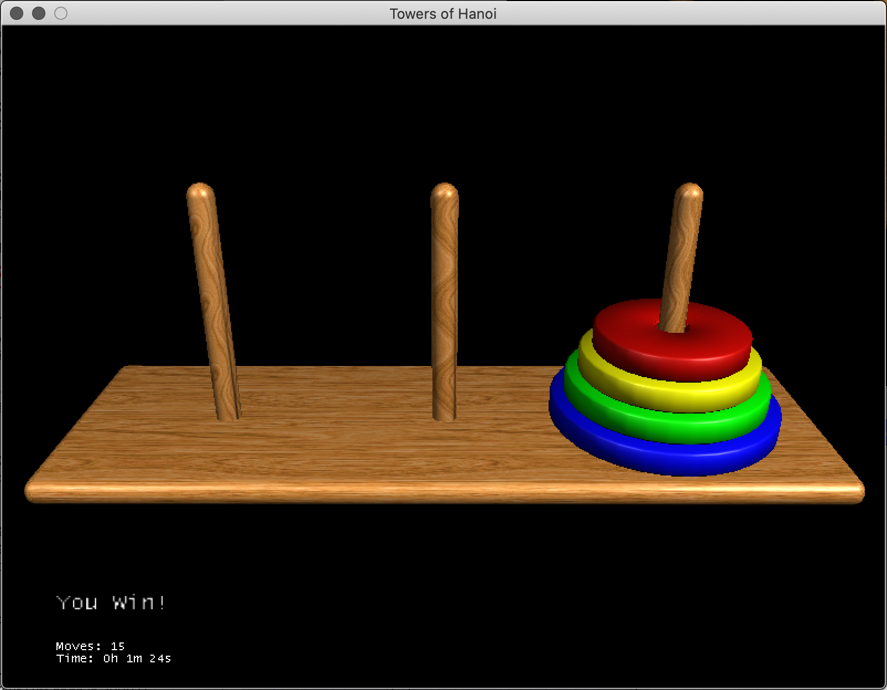

# Towers of Hanoi using JMonkeyEngine

This is a simple towers of Hanoi game implemented using JMonkeyEngine, and drawn from scratch.

The code is not particularly clean or well organized, it was just an exercise in making a short game for the purpose of learning.

As per the [License](LICENSE) file, this software is GPL 3.0 Licensed.
